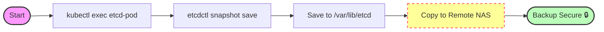
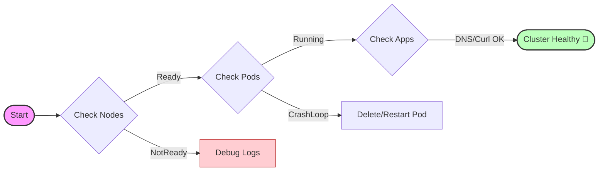

# Upgrading my Kubernetes Cluster with Kubeadm

**← [Part 1: Setting up the Kubernetes cluster](/posts/2025/08/20/homelab-part1/)** | **← [Part 2: Core Infrastructure and Tools](/posts/2025/09/05/homelab-part2/)** | **← [Part 3: GitOps and App of Apps](/posts/2025/11/30/homelab-part3/)**

As with any infrastructure, maintenance is key. In this post, I will tackle a critical Day 2 operation: upgrading my Kubernetes cluster to version 1.35 to take advantage of new features like [Memory and CPU resizing](https://kubernetes.io/docs/tasks/configure-pod-container/resize-container-resources/).

This post covers:
1. Backup strategies for etcd and cluster state
2. Upgrading the Control Plane
3. Upgrading Worker Nodes
4. Troubleshooting common upgrade issues

## Prerequisites

Before starting the upgrade process, ensure you have the following prerequisites met:
- A backup storage - I store my application data on a separate NAS, so I only need to back up the cluster state.
- Be sure to bring enough coffee ☕ and patience in case something goes wrong.

### Backup etcd

**Important:** Always backup your etcd data before performing a cluster upgrade. While kubeadm handles the upgrade gracefully, having a snapshot can save your cluster if things go south.
{: .notice--warning}



As I have not installed etcd on my laptop nor the control plane node, I will use `kubectl exec` to create a backup of the etcd data.

ETCD container images are usually held very small and dont include many cli tools such as `tar`, `gzip`, etc. So I will use `etcdctl` to create a snapshot of the etcd data to the host volume mounted to the etcd pod (you might need to adapt the `/etc/kubernetes/pki/etcd/` path)

```bash
SNAPSHOT_NAME="etcd-backup-$(date +%Y-%m-%d).db"

CMD="ETCDCTL_API=3 etcdctl --endpoints=https://127.0.0.1:2379 \
  --cacert=/etc/kubernetes/pki/etcd/ca.crt \
  --cert=/etc/kubernetes/pki/etcd/server.crt \
  --key=/etc/kubernetes/pki/etcd/server.key \
  snapshot save /etc/kubernetes/pki/etcd/$SNAPSHOT_NAME"

POD=$(kubectl get pods -n kube-system -l component=etcd -o jsonpath="{.items[0].metadata.name}")

kubectl exec -n kube-system $POD -- /bin/sh -c "$CMD"

ssh cp1 -t ls /etc/kubernetes/pki/etcd/ | grep etcd-backup
ssh cp1 -t "sudo mkdir -p /var/backups/etcd/ && sudo cp /etc/kubernetes/pki/etcd/$SNAPSHOT_NAME /var/backups/etcd/"
ssh cp1 -t "sudo chmod 600 /var/backups/etcd/$SNAPSHOT_NAME && du -sh /var/backups/etcd/$SNAPSHOT_NAME"
```

After creating the backup, I copied it to a safe location on my NAS.

## Upgrading Time!


After the backup I was ready to start the upgrade process. Since you should always jump only one minor version, and my cluster was running on `1.33.x`, I will first upgrade to `1.34.x`, and then repeat the process to reach `1.35.x`.

The steps for a single upgrade are as follows:

1. Upgrade kubeadm on the control plane node
2. Plan the upgrade
3. Apply the upgrade
4. Upgrade kubelet and kubectl on all nodes

### 1. Upgrade kubeadm on the control plane node

The documentation for upgrading a kubeadm cluster is available [here](https://kubernetes.io/docs/tasks/administer-cluster/kubeadm/kubeadm-upgrade/). Below are the steps I followed to upgrade my cluster from `1.33.x` to `1.35.x`.


#### 1. Upgrade kubeadm
The first thing I needed to do was to upgrade the `kubeadm` tool on the control plane node.


```bash
TARGET_VERSION="1.34"
# Replace the existing Kubernetes apt repository with the new version
sudo sed -i "s|:/v[0-9]*\.[0-9]*/|:/v${TARGET_VERSION}/|g" /etc/apt/sources.list.d/kubernetes.list
# Verify replacement
grep $TARGET_VERSION /etc/apt/sources.list.d/kubernetes.list || { echo "Failed to update the Kubernetes apt repository to version $TARGET_VERSION"; exit 1; }

# Update package list and install the desired kubeadm version
sudo apt-get update


PKG_VERSION=$(apt-cache madison kubeadm | grep $TARGET_VERSION | head -1 | awk '{print $3}')

if [ -z "$PKG_VERSION" ]; then
    echo "No kubeadm version $TARGET_VERSION.x found."
    exit 1
fi

# 3. Clean the version for kubeadm (Remove "-1.1" -> 1.34.3)
# I use 'cut' to take everything before the first hyphen
KUBE_VERSION=$(echo $PKG_VERSION | cut -d- -f1)

echo "Package Version: $PKG_VERSION"
echo "Kube Version:    $KUBE_VERSION"

if [ -n "$KUBE_VERSION" ]; then
    sudo apt-get install -y --allow-change-held-packages kubeadm=${PKG_VERSION}
    sudo apt-mark hold kubeadm
else
    echo "No kubeadm version $TARGET_VERSION.x found in the apt repository."
    exit 1
fi

# Verify the installation
kubeadm version
```


##### Upgrading the Control Plane

The control plane node needs to be upgraded first as it manages the overall cluster state and orchestrates the upgrade process for worker nodes.
For this it is [recommended to gracefully shut down the API](https://v1-34.docs.kubernetes.io/docs/tasks/administer-cluster/kubeadm/kubeadm-upgrade/#considerations-when-upgrading-etcd) server to allow in-flight requests to complete before proceeding with the upgrade.

```bash
sudo kubeadm upgrade plan "v${KUBE_VERSION}"
killall -s SIGTERM kube-apiserver # trigger a graceful kube-apiserver shutdown
sleep 20 # wait a little bit to permit completing in-flight requests
sudo kubeadm upgrade apply v${KUBE_VERSION} -y # execute a kubeadm upgrade command
kubeadm version # verify the upgrade
```

#####  Upgrade Kubelet and Kubectl


```bash
sudo apt-mark unhold kubelet kubectl
sudo apt-get update
sudo apt-get install -y kubelet=$PKG_VERSION kubectl=$PKG_VERSION
sudo apt-mark hold kubelet kubectl
sudo systemctl daemon-reload
sudo systemctl restart kubelet
```

---

### 2. Upgrade the Worker Nodes

To maintain my cluster availability, I upgraded each worker node one at a time. Here are the steps I followed for each worker node:

#### 1. Drain the Node

At first I drained the node to safely evict all running pods, except those managed by DaemonSets. Since my WP1 node contains critical infrastructure workloads, I opted to drain the other node first.
This needs to be run on the control plane node/any remote machine with `kubectl` access to the cluster.


```bash
kubectl drain <worker-node-name> --ignore-daemonsets
```

For WP2 I needed to add the `--delete-local-data` flag since it was hosting some pods with local storage and the --force flag since my netshoot pod was not managed by a controller. Lastly, the diruption budget defined in the CloudNativePG Operator was preventing the eviction of the PostgreSQL pod i the immich namespace, so I needed to remove it manually while the node was drained.


#### 2. Upgrade kubeadm (Run on Worker Node)




SSH into the worker node.

```bash
TARGET_VERSION="1.34"
# Replace the existing Kubernetes apt repository with the new version
sudo sed -i "s|:/v[0-9]*\.[0-9]*/|:/v${TARGET_VERSION}/|g" /etc/apt/sources.list.d/kubernetes.list
# Verify replacement
grep $TARGET_VERSION /etc/apt/sources.list.d/kubernetes.list || { echo "Failed to update the Kubernetes apt repository to version $TARGET_VERSION"; exit 1; }

# Update package list and install the desired kubeadm version
sudo apt-get update
PKG_VERSION=$(apt-cache madison kubeadm | grep $TARGET_VERSION | head -1 | awk '{print $3}')

echo "Package Version: $PKG_VERSION"
```


#### 3. Upgrade Node 
On workers, you use `upgrade node`, not `upgrade apply`.

```bash
sudo kubeadm upgrade node

sudo apt install kubectl=${PKG_VERSION} kubelet=${PKG_VERSION} --allow-change-held-packages
sudo apt-mark hold kubelet kubectl
sudo systemctl daemon-reload
sudo systemctl restart kubelet

```

#### 5. Uncordon the Node 

Lastly I uncordoned the node to allow scheduling of new pods.

```bash
kubectl uncordon <worker-node-name>

```

---

### Phase 4: Verification

1. **Check Nodes:**
I ran `kubectl get nodes`. All nodes reported the new version and status `Ready`.
2. **Check Pods:**
I ran `kubectl get pods -A`. Here I noticed that my CoreDNS started before my PiHole DNS and was thus stuck in `CrashLoopBackOff` with `level=fatal msg="Post \"http://pihole-web.pihole.svc.cluster.local/api/auth\": dial tcp 10.102.100.97:80: connect: connection refused"` - simply restarting the pod fixed the issue (`kubectl delete pod -n kube-system <coredns-pod-name>`).
3. **Check Applications:**
Using `curl` and `dig`, I performed a sanity check on ArgoCD to verify that my DNS and Nginx-Ingress were still working correctly.

```bash
dig +short @192.168.0.211 argocd.novotny.live # should return the IP of the ingress controller exposed by MetalLB
curl -I  https://argocd.novotny.live \       
  --resolve argocd.novotny.live:443:$(dig +short @192.168.0.211 argocd.novotny.live)
```

### Phase 5. Rinse and Repeat
Since my cluster was on version `1.33.x`, I needed to repeat the entire process to upgrade from `1.34.x` to `1.35.x`. I followed the same steps as above, updating the `TARGET_VERSION` variable to `1.35` and executing the upgrade process again.

#### Worker Node Upgrade to 1.35

The `kubelet` arg `--pod-infra-container-image` has been [deprecated](https://v1-34.docs.kubernetes.io/docs/reference/command-line-tools-reference/kubelet/) in **1.35**. If your `/var/lib/kubelet/kubeadm-flags.env` file contains this argument, you need to remove it before restarting the kubelet service.

```bash
sudo sed -i 's|--pod-infra-container-image=[^ ]*||g' /var/lib/kubelet/kubeadm-flags.env
sudo systemctl daemon-reload
sudo systemctl restart kubelet
sudo systemctl status kubelet --no-pager
```

---

**← [Part 1: Setting up the Kubernetes cluster](/posts/2025/08/20/homelab-part1/)** | **← [Part 2: Core Infrastructure and Tools](/posts/2025/09/05/homelab-part2/)** | **← [Part 3: GitOps and App of Apps](/posts/2025/11/30/homelab-part3/)**